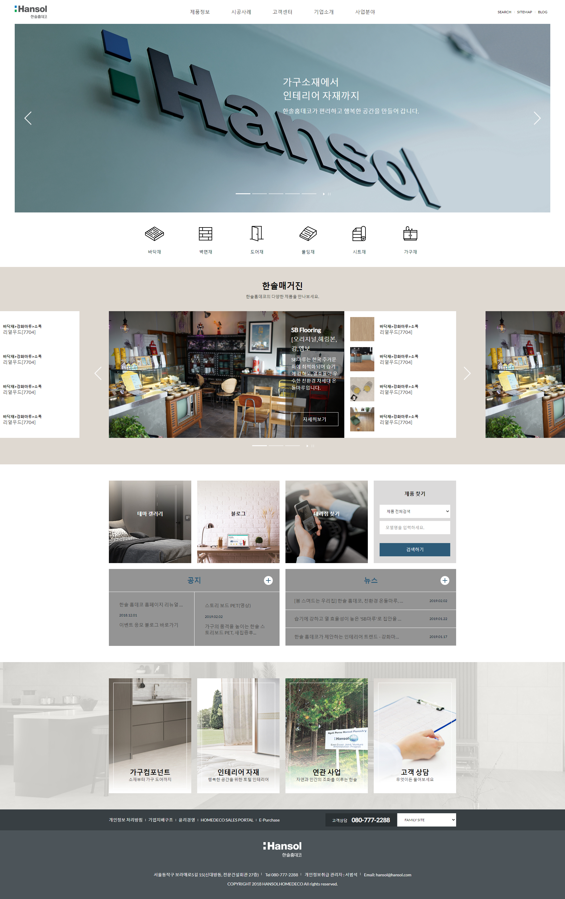

# Practice on html/css
 

[Source code](https://github.com/Tey-Jo/Project1)

Here is my small practice for html and css.   
My goal was copy only index page design, without any js function.  
This is a korean company, real site url below here.

[Original site link](http://www.hansolhomedeco.co.kr/home/)

